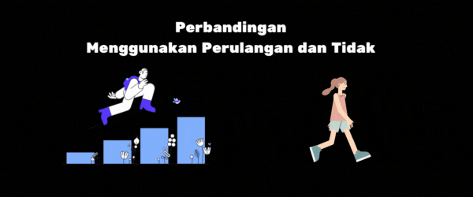

# Perulangan



## Apa itu Perulangan ?

Looping atau yang lebih dikenal dengan perulangan adalah suatu metode dalam pemrograman untuk meng eksekusi suatu berintah yang sama terus-menerus hingga kondisi tertentu terpenuhi.

## Kenapa Perulangan dilakukan


Ketika programmer membuat program looping maka akan menjadikan script yang harus ditulis sebanyak puluhan atau ratusan baris menjadi hanya beberapa baris saja. Menggunakan looping berarti membuat sesuatu yang dapat menghasilkan banyak output dengan minimal script.

Secara umum, perulangan ini dibagi dua.

Yaitu: counted loop dan uncounted loop.


Perbedaanya:

> - Counted Loop merupakan perulangan yang jelas dan sudah tentu banyak perulangannya (For, Foreach, Repeat).
> - Uncounted Loop, merupakan perulangan yang tidak jelas berapa kali ia harus mengulang (While, Do/While).

### 1. For

Perulangan for merupakan perulangan yang termasuk dalam couted loop, karena sudah jelas berapa kali ia akan mengulang.
Dengan sintaks sebagai berikut :

```
for(let i = 0; i < 10; i++){
    console.log("<p>Perulangan ke-" + i + "</p>")
}
```

Tahapan dalam pembacaan sintaks diatas, sebagaia berikut :

1. Yang perlu diperhatikan adalah kondisi yang ada di dalam kurung setelah kata for.
2. Kondisi ini akan menentukan:
   > - Hitungan akan dimulai dari 0 (i = 0);
   > - Hitungannya sampai berapa? Sampai i < 10;
   > - Lalu di setiap perulangan i akan bertambah +1 (i++).
   > - Variabel i pada perulangan for berfungsi untuk menyimpan nilai hitungan.

Jadi setiap perulangan dilakukan nilai i akan selalu bertambah satu. Karena kita menentukannya di bagian i++.
