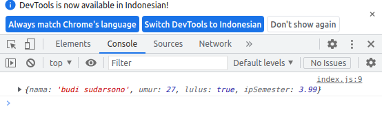
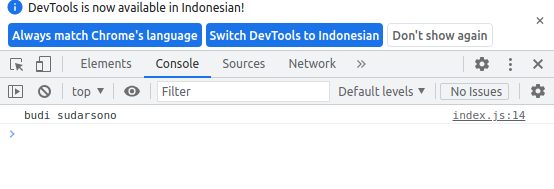
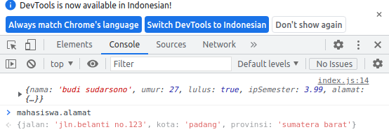
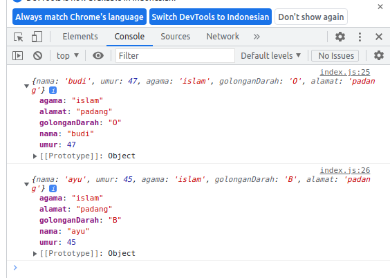
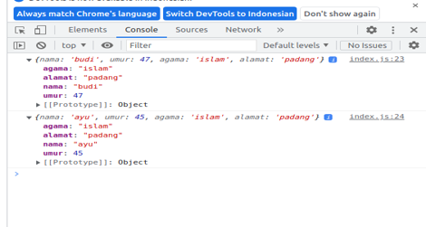

# Object


## 1. Pengertian Object

Perbedaan utama antara objek dan tipe data lain seperti string dan integer dalam JavaScript adalah bahwa objek dapat menyimpan berbagai tipe data sebagai nilainya. Di sisi lain, tipe data primitif seperti integer dan string hanya dapat menyimpan integer dan string, masing-masing, sebagai nilainya.

Objek adalah sebuah variabel yang menyimpan nilai (properti) dan fungsi (method).

<<<<<<< HEAD

## 2. Kenapa object

```
MAHASISWA

Var nama = ‘budi’
Var umur = 27
Var lulus = true
Var ipSemester : 3.99
```

Dari data mahasiswa dengan ditulis satu-satu masing data, sehingga kurang efektif untuk digunakan apabila skala banyak data yang akan digunakan

```

Var mahasiswa ={

	nama : ‘budi sudarsono’,
	umur : 27,
	lulus : true,
	ipSemester : 3.99,

}

Console.log(mahasiswa)

```

Output :



## 3. Akses Nilai Properti

Akses nilai properti dapat dilakukan dengan dua cara, yaitu:

> - 1.Penggunaan kurung siku ([ ]) setelah nama objek. Kurung siku kemudian diisikan dengan nama properti, yang harus berupa string.

```
var mahasiswa = {
  nama: 'budi sudarsono',
  umur: 27,
  lulus: true,
  ipSemester: 3.99,
}

console.log(mahasiswa['umur'])

```

Output :


> - 2.Penggunaan tanda titik (.) setelah nama objek diikuti dengan nama properti. Notasi ini merupakan notasi yang umum digunakan pada bahasa pemrograman lainnya

```
var mahasiswa ={
	nama : 'budi sudarsono',
	umur : 27,
	lulus : true,
	ipSemester : 3.99,
}

Console.log(mahasiswa.nama)

```

Output :



## 4. Object di dalam object

```
var mahasiswa = {
  nama: 'budi sudarsono',
  umur: 27,
  lulus: true,
  ipSemester: 3.99,
  alamat: {
    jalan: 'jln. Belanti no.123',
    kota: 'padang',
    provinsi: 'sumatera barat'
  }
}
console.log(mahasiswa)

```

Output :



## 5. Membuat object pada javascript

> - Obejct literal
> - Function deklarasi

1. Oject Literal

```
var ayah = {
   nama: 'budi',
   umur:47,
   agama: 'islam',
   golonganDarah:'O',
   alamat:'padang'
}
var ibu ={
    nama: 'ayu',
    umur: 45,
    agama:'islam',
    golonganDarah:'B',
    alamat:'padang'
}
console.log(ayah)
console.log(ibu)
```

Ouput :



2.Function Deklarasi

```
function objekKeluarga(nama,umur,agama,alamat){
   var keluarga={}
   keluarga.nama=nama
   keluarga.umur=umur
   keluarga.agama=agama
   keluarga.alamat=alamat
return keluarga

}
var ayah= objekKeluarga('budi',47,'islam','padang')
var ibu=objekKeluarga('ayu',45,'islam','padang')

console.log(ayah)
console.log(ibu)

```

Output :

# 
